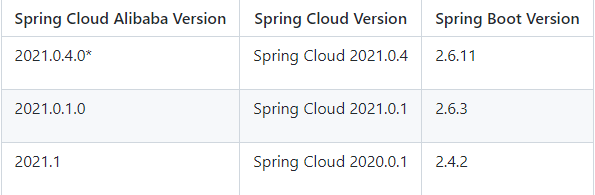
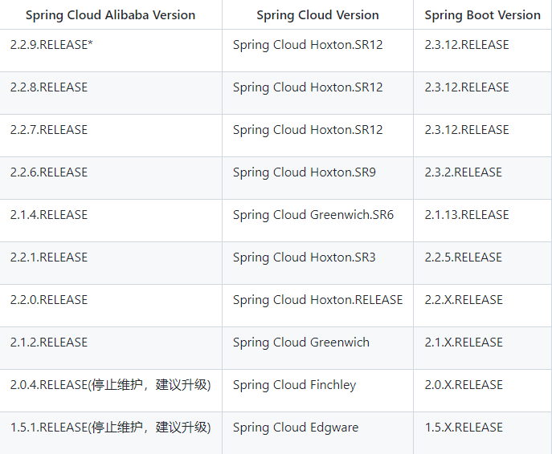
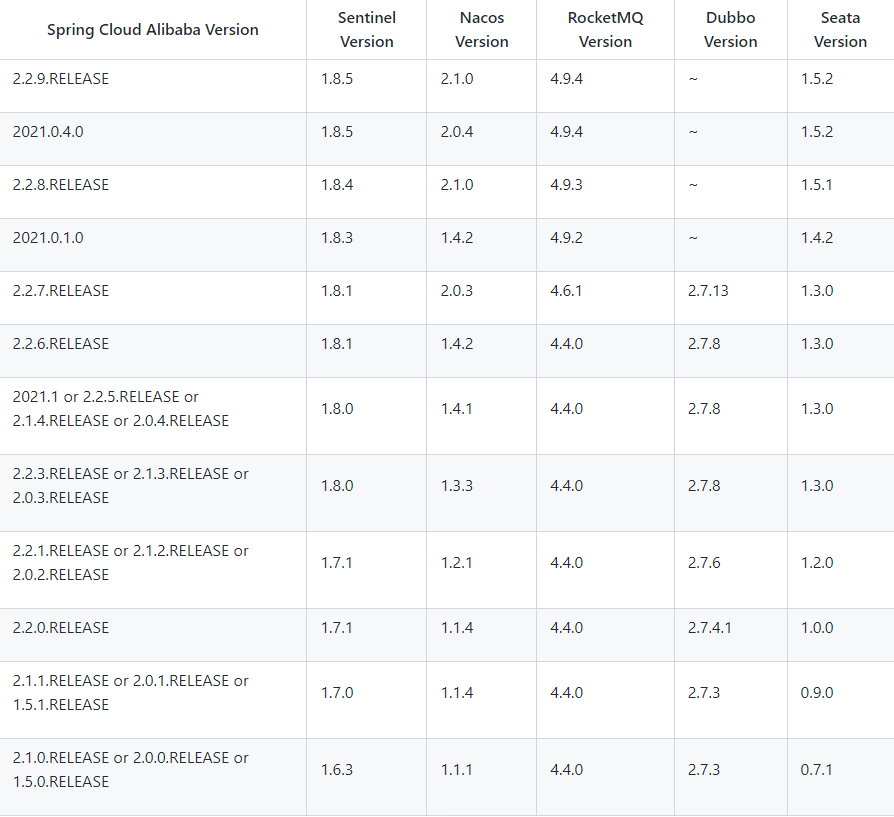

## 毕业版本依赖关系(推荐使用)
由于 Spring Boot 2.4+ 和以下版本之间变化较大，目前企业级客户老项目相关 Spring Boot 版本仍停留在 Spring Boot 2.4 以下，为了同时满足存量用户和新用户不同需求，社区以 Spring Boot 2.4 为分界线，同时维护 2.2.x 和 2021.x 两个分支迭代。
### 2021.x 分支
适配 Spring Boot 2.4, Spring Cloud 2021.x 版本及以上的 Spring Cloud Alibaba 版本如下表（最新版本用*标记）： (注意，该分支 Spring Cloud Alibaba 版本命名方式进行了调整, 未来将对应 Spring Cloud 版本， 前三位为 Spring Cloud 版本，最后一位为扩展版本，比如适配 Spring Cloud 2021.0.1 版本对应的 Spring Cloud Alibaba 第一个版本为：2021.0.1.0，第个二版本为：2021.0.1.1，依此类推)

### 2.2.x 分支
适配 Spring Boot 为 2.4, Spring Cloud Hoxton 版本及以下的 Spring Cloud Alibaba 版本如下表（最新版本用*标记）：

### 组件版本关系
每个 Spring Cloud Alibaba 版本及其自身所适配的各组件对应版本如下表所示：

***
### [wiki](https://github.com/alibaba/spring-cloud-alibaba/wiki/%E7%89%88%E6%9C%AC%E8%AF%B4%E6%98%8E)